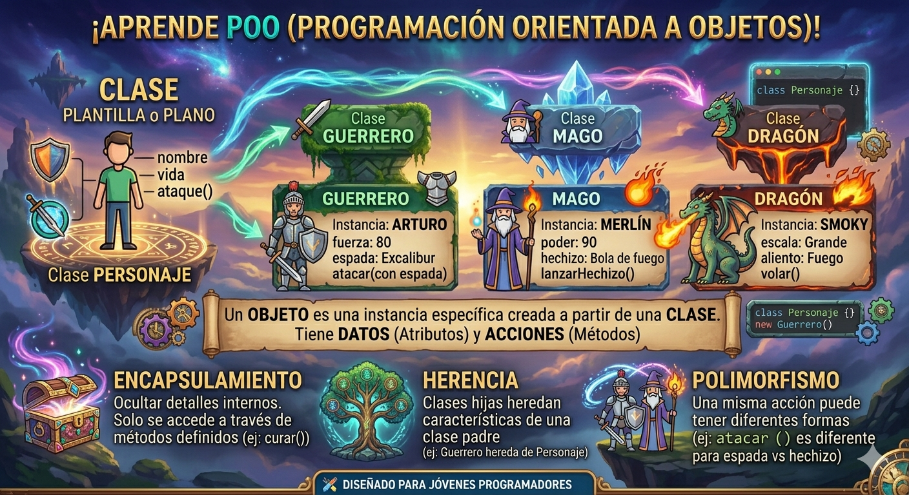

# POO en python 
introduccion a la Programacion Orientada a objetos (POO) en python 

## ¿porque aprender POO?

- Imagina que quieres crear un video juego, tienes guerreros, magos, dragones... Cada uno con sus propios puntos de vida, ataques y abilidades. ¿Cómo los organizo en codigo sin repetir todo una y ota vez? 

- la **Programacion Orientada a objetos (POO)** es la respuesta. En lugar de escribir instrucciones sueltas, modelas el mundo real con *objetos* que tienen caracteristicas y comportamientos. Es la forma en que estan constridos la mayoria de los programas profesionales del mundo

 

## Clase y obletos 

- Una clase es un tipo de datos cuyas variables se llaman objestos o instancias 

- La clase es la definicion del concepto del mundo real y los objetos o instancias son el propio 
"objeto" del mundo real 
- Las clses estan compuestas por dos elementos: 
    - **Atributos:** informacion que almacena la clase. 
    - **Mentodos:** operaciones que pueden realizarce con la clase 

## Definicion de una clase en python 

``` python 
class nombreClase: 
    def_int_(self, variable1, variable2):
        self.atributo1 = valor 1 
        self.atributo2 = valor 2 

    def nombeMetodo(self): 
        BloqueCodigo
```

- `class` : palabra reservada en python para definir una clase.
- `NombreClase` : nombre de la clase que se quiere crear.
- `def`: palabra reservada en python que se utiliza para definir tanto el constructor de la clase (metodo que se ejecuta la primera vez que usas una clase) como los diferentes metodos que tiene. 
- `__init__` : palabra reservada en python para definir el metodo constructor de la clase. el metodo `_int_` es lo primero que se ejecuta cuando creas un objeto de una clase. 
- `(sel, variables)`: parametro del constructor de la clase. El parametro `self` es obbligatorio y despues puedes poner tantos parametros como quieras. La forma de añadir parametros es la misma que en las funciones .
-`self.atributox`: forma de utilizacion y acceso a los atributos de la clase.
- `NombreMetodo`: nombre del metodo de la clase.
- `self` : parametro del metodo. El parametro `self` es obligatorio y despues puedes tener tantos parametros como quieras. La forma de añadir parametros es la misma que en las funciones.
- `BloqueCodigo` : instrucciones que ejecutara el metodo. 

**Al definir una clase tenga en cuenta:** 
- Puedes  definir tantos atributos como necesites. 
- Puedes definir tantos metodos como necesites.
- Puedes definir tantos parametros en el constructor y en los metodos como necesitas. 

## Ejemplo 1

-crear una clase que reprecente a una persona 
-Atributos: nombres, atributos y edad.
-Metodos: mostrar la informacion der la persona.

### Codigo

```python 
class persona:
    def__init__(self, nombre, apellido, edada):
        self.nombre = nombre 
        self.apellido = apellido 
        self.edad = edad 

def MostrarPersona(self):
    print("Nombre: ", self.nombre)
    print("Apellidos: ", self.apellidos)
    print("Edad: ", self.edad)
```
class persona:

    # Metodo constructor de la clase 
    def __init__(self, nombre, apellidos, edad):
        self.nombre = nombre 
        self.apellido = apellidos
        self.edad = edad 

# Metodo para mostrar la informacion de la persona: 
    def mostrarPersona(self):
        print("Nombre: ", self.nombre)
        print("Apellido: ", self.apellidos)
        print("Edad: ", self.edad)

"""
def main():
    print("vamos a aprender POO...")

if __name__ == main():
    main() 
"""


## Compocision 

- consiste en la creacion de nuevas clases a partir de otras clases ya existentes que actuan como elementos compositores de la nueva. 
- Las clases existentes seran atributos de la nueva clase 

### Ejemplo 

- Una cordenada en dos dimensiones esta compuesta por dos valores, el valor del eje de las x y el valor en el eje de las y. Esto podria ser una clase. 
- Un cuadrado esta compuesto por cuatro cordenadas que son los cuatro vertices. Esto podria ser una clase que esta compuesta por cuatro clases del objeto cordenada. 

### Codigo python 
```python 
class cordenada: 
    # Metodo constructor 
    def__init__(self, x, y):
       self.x = x 
       sels.y = y 

    def mostrarCordenada(sels): 
        print("(",self.x,",", self.y," )")

class cuadrado: 
    # Metodo constructor 
    def__init__(self, v1, v2, v3, v4):
       self.v1 = v1  
       self.v2 = v2
       self.v3 = v3
       self.v4 = v4
    
    def mostrarVertices(self):
        print("El cuadrado esta compuesto por los siguientes vertices")
        self.v1mostrarCordenada()
        self.v2mostrarCordenada()
        self.v3mostrarCordenada()
        self.v4mostrarCordenada()
```
### Encapsulacion

- Uno de los objetivos que tiene la (POO) es protejer los datos de acceso o usos no controlados y esto es lo que se conoce como *encapsulacion* 
- Los datos (atributos) que componene una clase pueden ser de dos tipos:
    - **publicos:** los datos son accesibles sin control, es decir, los datos pueden ser usados sin ningun tipo de mecanismo que proteja ante usos no autorizados o indevidos.
    - **privados:** los datos no pueden ser accedidos sin control y para acceder a ellos. De esta manera, los datos unicamente seran accedidos ditrectamente por la propia clase.
- La encapsulacion puede realizarce sobre los metodos.
- La definicion de atributos privados se realiza incluyendo los caracteres "__" (dos quiones de piso) entre la palabra *self* y el nombre del atributo 

### Ejemlo 

### Codigo python 
```python 
class cordenada: 
    # Metodo constructor 
    def__init__(self, x, y):
       self.x = x 
       sels.y = y 
    # Metodo de accseso 
    def getX(self):
        return self.__x
    
    def setX(self, x): 
        self.__x = x 
    
    def getY(self):
        return self.__Y
    
    def setY(self, y ): 
        self.__Y = y 
    
    # Metodo para mostrar la cordenada
    def mostrarCordenada(self):
        print("(",self.__x,","self.__y,")")


    def mostrarCordenada(sels): 
        print("(",self.x,",", self.y," )")

class cuadrado: 
    # Metodo constructor 
    def__init__(self, v1, v2, v3, v4):
       self.v1 = v1  
       self.v2 = v2
       self.v3 = v3
       self.v4 = v4
    
    def mostrarVertices(self):
        print("El cuadrado esta compuesto por los siguientes vertices")
        self.v1mostrarCordenada()
        self.v2mostrarCordenada()
        self.v3mostrarCordenada()
        self.v4mostrarCordenada()
```

## Herencia
- Permite la reutilización de código.
- Consiste en la definición de una clase utilizando como base una clase ya existente.
- La nueva clase derivada tendrá todas las caracteristicas de la clase base y ampliará el concepto de esta, es decir, tendrá todos los atributos y métodos de la clase base.
- Significa que entre dos clases existe una relación del tipo "es un".
- La herencia en Python se especifica de la siguiente manera: ```class NombreClase(ClaseBase):```
- Ejemplo:
    - Pensemos en una persona como una clase, la persona tendría una serie de atributos como pueden ser el nombre, los apellidos, la edad, etc.  Esas características de una persona serían compartidas por todas aquellas clases hijas como pueden ser alumno y profesor.  Es decir, alumno y profesor heredarían las propiedades de la clase persona y tendrían sus propias propiedades, diferentes entre ellas, como por ejemplo el curso en el que está el alumno y el horario de tutorias del profesor.

    - Clase base: Persona
        - Atributos:
            - Nombre
            - Apellidos
            - Edad

    - Clase derivada: Alumno
        - Atributos:
            - Curso
            - Asignaturas
    
    - Clase derivada: Profesor
        - Atributos:
            - Antigüedad
            - Tutorias
            - Teléfono